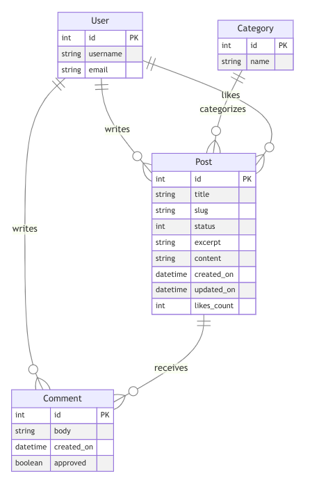

---

# Cultivating Intelligence

[View Live Website](https://cultivating-intelligence-1ead7384db49.herokuapp.com/)  
[View Repository](https://github.com/Josseyo/Cultivating_Intelligence)  

[View README.md](https://github.com/Josseyo/Cultivating_Intelligence/main/README.md)

[View Kanban and agile project](https://github.com/users/Josseyo/projects/4)

## Table of Contents 

- [Wireframes](#wireframes)
- [Features](#features)
- [UX Design](#ux-design)
- [User Stories](#user-stories)
- [Design](#design)
- [Database](#database)
- [Code Structure](#code-structure)
- [Agile Methodology](#agile-methodology)
- [Testing](#testing)
- [Deployment](#deployment)
- [Bugs](#bugs)
- [Issues/Improvements](#issuesimprovements)
- [Technologies](#technologies)
- [Credits](#credits)
- [Process](#process)

## Wireframes

*(Add wireframe images or links here)*

## Features

- User registration and login
- Post creation, editing, and deletion
- Like and comment functionality
- Category filtering for posts
- Admin panel for managing content

## UX Design

### User Flow

1. **View Post List**: Users arrive at the homepage displaying all published posts, with options to filter by category from the menu in the navbar.
2. **Open a Post**: Users can click on a post to view its full content, along with options to like, comment, or share.
3. **View Likes**: Users can see the number of likes on the post.
4. **View Comments**: Users can view and interact with comments below each post, including edit and delete user's own comments.
5. **Account Registration**: Users must register to like or comment, with a straightforward registration process.
6. **Blog management**: Admin can log in to django dashboard to view, sort, add, edit and delete; posts, comments, likes, categories, and users.

### User Stories

- As a Site User, I can view a list of posts to select one to read.
- As a Site User, I can click on a post to read its full text.
- As a Site User, I can navigate to different category pages to read sorted posts.
- As a Site User, I can view the number of likes to identify popular posts.
- As a logged-in Site User, I can view comments on a post to engage in discussions.
- As a logged-in Site User, I can leave comments on posts to add my input
- As a logged-in Site User, I can like or unlike posts, to show my appreciation 
- As a Site Admin, I can manage posts and comments effectively.

## Design

### Colors
<details><summary>Click to view colors</summary>


- **Blue** #233D4D
- **Orange** #FE7F2D
- **Yellow** #FCCA46
- **Green** #A1C181
- **Turkose** #619B8A

[Colors](docs/images/colors.png)

These colors have been chosen based on their psychological effects, aiming to enhance user experience and support individuals with Attention Deficit Hyperactivity Disorder (ADHD).

### 1. Blue (#233D4D)
- **Calming Effect and Focus Enhancement**: Blue promotes tranquility, helping to reduce anxiety and improve concentration while reading or engaging with content.
- **Usage:** Use for the main title to create a calming and focused impression.

### 2. Orange (#FE7F2D)
- **Energy and Enthusiasm**: Orange stimulates mental activity and can make the blog feel more inviting and engaging. 
- **Usage**: Use for section headlines to grab attention and energize the content.

### 3. Yellow (#FCCA46)
- **Optimism and Attention-Grabbing**: Yellow is uplifting and can enhance mood, making the reading experience more enjoyable. This bright hue effectively highlights important information or calls to action, without overwhelming the user.

### 4. Green (#A1C181)
- **Balance and Harmony**: Green evokes a sense of calmness and balance, creating a soothing environment for readers. This color can help reduce visual fatigue, making it easier for users to engage with longer articles.
- **Usage:** Use for category labels to convey balance and organization.

### 5. Turquoise (#619B8A)
- **Refreshing and Invigorating for Mental Clarity**: Turquoise combines the calming effects of blue with the uplifting qualities of green, providing a refreshing visual experience. This color enhances clarity and encourages communication.
- **Usage:** Use this refreshing color for excerpts to encourage readers to engage with the content.

The selected color palette is designed to create an engaging and supportive environment for users, particularly those with ADHD, ensuring a cohesive and user-friendly interface that enhances readability and interaction throughout the blog.

</details>

### Fonts

*(Specify font choices)*

## Database
I have used [CI Database](https://dbs.ci-dbs.net/) for the project.

### Entity-Relationship Diagram (ERD)  

The database structure is based on a PostgreSQL model, representing tables, columns, relationships, and constraints.

### Database Models

- **User Model**: Represents users with unique usernames and emails.
- **Post Model**: Contains details for each blog post, including title, content, and author.
- **Comment Model**: Manages comments associated with posts.
- **Category Model**: Organizes posts into categories.
- **Like Model**: Allows users to express likes for posts.

### ERD Relationships

- **User to Post**: One-to-Many (A user can have multiple posts; each post is associated with one user.)
- **User to Comment**: One-to-Many (A user can have multiple comments; each comment is associated with one user.)
- **Post to Comment**: One-to-Many (A post can have multiple comments; each comment is associated with one post.)
- **Category to Post**: One-to-Many (A post belongs to one category; a category can have multiple posts.)

<details><summary>Click to view ERD</summary>

</details>

## Code Structure

The project code is organized within application folders, constructed using the Django framework.

### Project Apps

*(List project apps here)*

### Other Django Apps

- **settings.py**: Configuration settings for the Django project.
- **Procfile**: Commands for deploying the Django app.
- **static**: Base CSS and JavaScript files.
- **templates**: Base-level and app-specific HTML templates.
- **requirements.txt**: Lists dependencies for the project.
- **env.py**: Stores environment variables securely.

## Agile Methodology

[View Kanban Board](https://github.com/users/Josseyo/projects/4)

A Kanban board was created using GitHub Projects to manage user stories and the development process.

### MUSCOW Prioritization

- **Must Have**: Core functionalities for MVP.
- **Should Have**: Important features for future development.
- **Could Have**: Enhancements for user experience.
- **Would Be Nice To Have**: Additional features for future consideration.

### Future Development

- **Could Have**: Nested comments for hierarchical discussions.
- **Tags**: Allow users to tag posts for easier searching.


## Testing

The flow was tested during and post development

   - Device Testing
   - Browser Compatibility
   - Manual Testing

---

### Code Validation

- **HTML** Validated using [W3C HTML Validator](https://validator.w3.org/)
- **CSS** Validated using [Jigsaw W3 Validator](https://jigsaw.w3.org/css-validator/)
- **Javascript** validated using [JS hint](https://jshint.com)
- **Python** validated using [CI Python Linter](https://pep8ci.herokuapp.com/)
- **Performance** validated using [Lighthouse](https://developers.google.com/web/tools/lighthouse/)
- **Accessibility** validated using [Wave Validator](https://wave.webaim.org/) 

[Terminal errors fixes](https://docs.google.com/document/d/1ebW5cHddPkr2NpX6HFFQn2LsT-bAh9Y6OB7q3mzyrgo/edit?usp=sharing)

[Validation errors and fixes](https://docs.google.com/document/d/1E_De--nyuZ5WqO-qT4h3DGXI8gPx17r_KLHbBCgbNo0/edit?usp=sharing)

### Web app passed validators with no errors. 

### Html

<details><summary>Click to view html-validation errors</summary>
>
</details>

<details><summary>Home</summary>

</details>

<details><summary>Register</summary>

</details>

<details><summary>Login</summary>

</details>

<details><summary>Logout</summary>

</details>

<details><summary>Blog detail</summary>

</details>

<details><summary>Category</summary>

</details>

<details><summary>Comment ad/edit/delete</summary>

</details>

### CSS
[Jigsaw W3 Validator](https://jigsaw.w3.org/css-validator/) was used to validate the css styling

<details><summary>Style.css</summary>
</details>

   
### Javascript
[JShint](https://jshint.com/) was used to validate the custom script file: comments.js


<details><summary>Js file</summary>

</details>


### Python
[CI Python Linter](https://pep8ci.herokuapp.com/) to check  Python code for validity and conventions

<details><summary>Blog app</summary>

   <details><summary>admin.py</summary>
   
   </details>

   <details><summary>apps.py</summary>
   
   </details>

   <details><summary>forms.py</summary>
   
   </details>

   <details><summary>models.py</summary>
   
   </details>

   <details><summary>tests.py</summary>
   
   </details>

   <details><summary>urls.py</summary>
   
   </details>

   <details><summary>views.py</summary>
   
   </details>

</details>

   ***

<details><summary>cultivating_intelligence_blog app</summary>

   <details><summary>asgi.py</summary>
   
   </details>

   <details><summary>settings.py</summary>
   
   </details>

   <details><summary>urls.py</summary>
   
   </details>

   <details><summary>wsgi.py</summary>
   
   </details>

   <details><summary>models.py</summary>
   
   </details> 
</details>


### Lighthouse

[Lighthouse](https://developers.google.com/web/tools/lighthouse/) used for analyzing performance, accessibility and SEO for the project. Below are the results of the analysis:
 
<details><summary>Home Desktop-screen</summary>


   </details>
   <details><summary>Home Mobile-screen</summary>
   
   </details>

<details><summary>Register page Desktop-screen</summary>

</details>
<details><summary>Register page Mobile-screen</summary>

</details>

<details><summary>Login Desktop-screen</summary>

</details>

<details><summary>Login page Mobile-screen</summary>

</details>

<details><summary>Blog detail Desktop-screen</summary>

</details>

<details><summary>Blog detail Mobile-screen</summary>

</details>

<details><summary>Comment edit Desktop-screen</summary>

</details>

<details><summary>Comment edit Mobile-screen</summary>

</details>

<details><summary>Category Desktop-screen</summary>

</details>

<details><summary>Category Mobile-screen</summary>

</details>

### Wave
[Wave Validator](https://wave.webaim.org/) to evaluate accessibility

<details><summary>Home</summary>

</details>

<details><summary>Register</summary>

</details>

<details><summary>Login</summary>

</details>

<details><summary>Logout</summary>

</details>

<details><summary>Confirm logout</summary>

</details>

<details><summary>Blog detail</summary>

</details>

<details><summary>Category</summary>

</details>

## Testing


The project was tested during and post development
    - Device Testing
    - Browser Compatibility
    - Manual Testing

## Bugs

[View Bug Documentation](https://docs.google.com/document/d/1ebW5cHddPkr2NpX6HFFQn2LsT-bAh9Y6OB7q3mzyrgo/edit)

## Heroku Deployment

Before deploying to Heroku, ensure you have the following variables prepared:

- **Database URL**
- **SECRET_KEY** (You can generate one [here](https://miniwebtool.com/django-secret-key-generator/))
- **CLOUDINARY_URL** (After logging in to the Cloudinary website, copy the 'Cloudinary URL' from your account dashboard)


<details><summary>Deploying to Heroku - step by step </summary>

1. **Create `env.py`**: At the root level of your project, create a file named `env.py` and add the following lines, replacing the placeholders with your actual values:

   ```python
   import os

   os.environ['DATABASE_URL'] = 'your_Database_URL'
   os.environ['SECRET_KEY'] = 'your_secret_key'
   os.environ['CLOUDINARY_URL'] = 'your_cloudinary_url'
   ```

2. **Sign Up or Log In to Heroku**:
   - Go to the [Heroku website](https://www.heroku.com/) and sign up or sign in to your account.

3. **Create a New App**:
   - From the Heroku dashboard, click on "Create New App."
   - Choose a unique name for your app and select the appropriate region, then click on the 'Create App' button.

4. **Set Up Environment Variables**:
   - Navigate to the 'Settings' tab of your newly created app.
   - Click on 'Reveal Config Vars' and add the following environment variables:
   - `DATABASE_URL`: Your Database URL
   - `SECRET_KEY`: Your generated secret key
   - `CLOUDINARY_URL`: Your Cloudinary URL
   - `DISABLE_COLLECTSTATIC`: Set this variable to `1` (this can be removed after the initial deployment)
   - `PORT`: Set this variable to `8000`

5. **Deploy Your App**:
   - Select the 'Deploy' tab from the dashboard.
   - In the Deployment method section, choose "Connect to GitHub."
   - Find your GitHub repository by name and connect it.
   - At the bottom of the page, select either "Automatic Deploys" or "Manual Deploys" based on your preference.

6. **Start the Deployment Process**:
   - Click on the option you chose, and you should see the deployment process begin.

</details>

---

<details><summary>Forking the GitHub Repository</summary>

1. **Log In or Sign Up**:
   - Go to [GitHub](https://github.com/) and log in or create an account.

2. **Access the Repository**:
   - Navigate to the [GitHub repository](https://github.com/Josseyo/Cultivating_Intelligence).

3. **Fork the Repository**:
   - Click the "Fork" button in the top right corner.
   - A copy of the repository will be created in your own GitHub account.

</details>

---

<details><summary>Cloning a GitHub Repository</summary>

1. **Go to the Repository**:
   - Visit the [GitHub repository](https://github.com/Josseyo/Cultivating_Intelligence).

2. **Locate the Code Button**:
   - Click the "Code" button above the list of files (next to 'Add file').

3. **Choose a Cloning Option**:
   - Select either HTTPS or GitHub CLI as your preferred cloning method.

4. **Open Git Bash**:
   - Launch Git Bash on your computer.

5. **Change Directory**:
   - Navigate to the directory where you want to clone the repository.

6. **Clone the Repository**:
   - Type the following command, replacing the URL with the one you copied:

   ```bash
   git clone https://github.com/Josseyo/Cultivating_Intelligence
   ```

7. **Press Enter**:
   - Hit Enter to create your local clone of the repository.

</details>

---

## Issues/Improvements

- Consistency in typography, including text and heading levels.

## Technologies

- CI Database: https://dbs.ci-dbs.net/

## Credits

- User Stories Reference: [CI Blog user stories](https://github.com/Code-Institute-Solutions/BlogUserStories/blob/main/userstories.md)
- User Stories Reference: [GitHub Repository Rockroman](https://github.com/rockroman/CI_PP4-Knowledge-Flow/blob/main/README.md?plain=1)
- CI Django Blog Tutorial: [YouTube Video](https://www.youtube.com/watch?v=YH--VobIA8c&t=1453s)

### Fonts
- Font Awesome: [Font Awesome](http://fontawesome.io/)

### Imagery

- Post images from: [Stock Cake](https://stockcake.com)
- Default blog post image from [Unsplash](https://unsplash.com...)

## Process

### Challenges

- Rearranging user stories in the Kanban board was challenging initially.
- Issues with the CI database caused interruptions and confusion.
- Maintaining documentation in GitHub was time-consuming.

---

