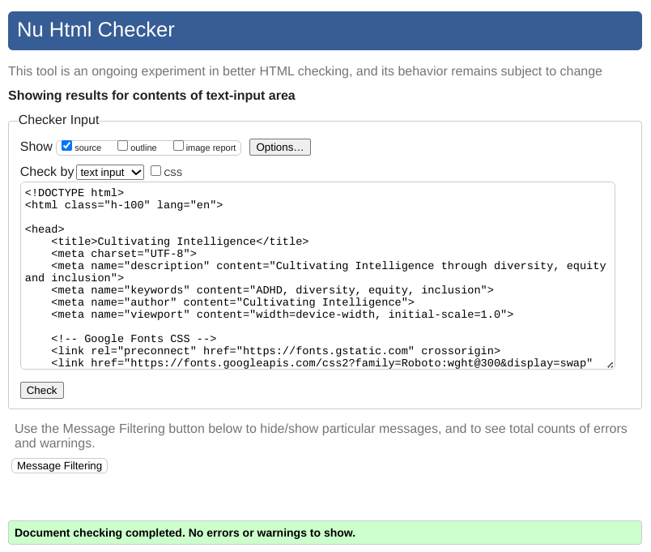
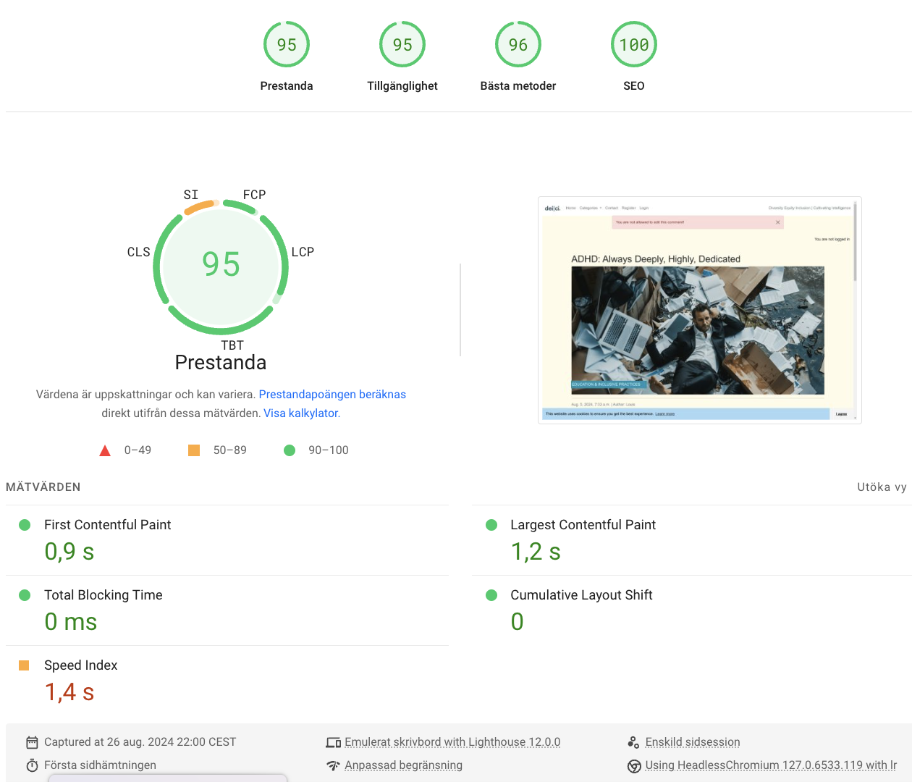

  
---

# Cultivating Intelligence

[View Live Website](https://cultivating-intelligence-1ead7384db49.herokuapp.com/)  
[View Repository](https://github.com/Josseyo/Cultivating_Intelligence)  

[View README.md](https://github.com/Josseyo/Cultivating_Intelligence/main/README.md)

[View Kanban and agile project](https://github.com/users/Josseyo/projects/4)

## Table of Contents 
- [Introduction](#introduction)
- [Wireframes](#wireframes)
- [Features](#features)
- [UX Design](#ux-design)
- [User Stories](#user-stories)
- [Design](#design)
- [Database](#database)
- [Code Structure](#code-structure)
- [Agile Methodology](#agile-methodology)
- [Testing](#testing)
- [Deployment](#deployment)
- [Bugs](#bugs)
- [Issues/Improvements](#issuesimprovements)
- [Technologies](#technologies)
- [Credits](#credits)
- [Process](#process)

## Introduction
Welcome to Cultivating Intelligence, a blog focused on Diversity, Equity, and Inclusion (DEI) in the workplace, with a special emphasis on Attention Deficit Hyperactivity Disorder (ADHD). The mission is to raise awareness about the unique challenges faced by individuals with ADHD and advocate for equitable practices that empower all employees. Through insightful articles and personal stories, we aim to provide resources for employers and employees alike. Join us in creating a work culture that values every voice and ensures everyone has the opportunity to thrive.

## Features

- User registration and login
- Comment creation, editing, and deletion
- Like and comment functionality
- Category filtering for posts
- Contact view for collaboration request
- Admin panel for managing content
- Custom 404 view
- Cookies

## UX Design

### Wireframes

**Startview**: Users arrive at the homepage displaying all published posts, with options to filter by category from the menu in the navbar.

**<details><summary>View Post List</summary>**


</details>

---

**Open a Post**: Users can click on a post to view its full content, along with options to **like** and **comment.**

**<details><summary>Post detailed view</summary>**

</details>

---

**Account Registration**: Users must register to like or comment, with a straightforward registration process.

**<details><summary>Signup, login, logout</summary>**

</details>

---

**Contact us**: Users can contact us for contributions and collaboration ideas, through a contact form.

**<details><summary>Contact view</summary>**

</details>

---

### User Stories

<details><summary>As a Site User, I can view a list of posts to select one to read.</summary>

</details>

---

<details><summary>As a Site User, I can click on a post to read its full text.</summary>

</
</details>

---

<details><summary>As a Site User, I can navigate to different category pages to read sorted posts.</summary>

</details>

---

<details><summary>As a Site User, I can view the number of likes to identify popular posts.</summary>

</details>

---

<details><summary>As a logged-in Site User, I can view comments on a post to engage in discussions.</summary>

</details>

---

<details><summary>As a logged-in Site User, I can leave comments on posts to add my input.</summary>

</details>

---

<details><summary>As a logged-in Site I can edit and delete my own comments, if I change my mind.</summary>

</details>

---

<details><summary>As a logged-in Site User, I can like or unlike posts, to show my appreciation.</summary>

</details>

---

<details><summary>As a Site Admin, I can log in to django dashboard and manage posts, comments, categories, likes and users.</summary>


</details>


## Design

### Colors

Colors were chosen  to create a visually appealing and supportive environment for individuals with ADHD, promoting focus and reducing distractions.


<details><summary>About the colors</summary>

### **White (#ffffff)**
A pure, clean color that represents simplicity and clarity.

**Benefits**: White creates a sense of spaciousness.. It reduces distractions, allowing individuals with ADHD to focus better on the content without feeling overwhelmed.

### **Light Background (#fffce9)**
A soft, warm off-white with a hint of yellow.

**Benefits**: A  gentle background  on the eyes promotes a sense of warmth and comfort. It reduces visual strain, making it easier for individuals with ADHD to engage with the content.

### **Blue (#003f66)**
A deep, calming blue that conveys trust and stability.

**Benefits**: Blue is known for its calming effects and can enhance concentration. It can help individuals with ADHD feel more focused and less anxious, making it a good choice for backgrounds or accents to create strong contrast without being too harsh

### **Dark Grey (#c05b56)**
A muted, earthy tone that adds depth and sophistication.

**Benefits**: Dark grey can provide a strong contrast without being too harsh, helping to highlight important information. It can also evoke a sense of seriousness and professionalism, which may help in maintaining attention.

### **Gold (#b0702a)**
A rich, warm gold that evokes feelings of positivity and warmth.

**Benefits**: Gold can stimulate feelings of optimism and creativity. It can be used to draw attention and encourage engagement without overwhelming the viewer. Used for detail in logo/brand name.
</details>

### Fonts
Lato is a sans-serif typeface and is used for the brand logo. It is suitable for individuals with ADHD. The clean letterforms enhance readability, reducing visual clutter and helping users focus on the text. 

<details><summary>Primary Font</summary>
  - Lato, sans-serif
  - Font Size: 1.6rem
  - Font Weight: 700 (Bold) for brand text

- **Text Weights**
  - Bold: font-weight: bold;
  - Thin: font-weight: 300;
</details>

## Database
I have used [CI Database](https://dbs.ci-dbs.net/) for the project.

## Storage
[Cloudinary](https://cloudinary.com/) is used for managing images in the cloud. 

### Fonts
- Font Awesome: [Font Awesome](http://fontawesome.io/)

### Imagery
- Post images from: [Stock Cake](https://stockcake.com)
- Default blog post image from [Unsplash](https://unsplash.com...)

### Entity-Relationship Diagram (ERD)  
The database structure is based on a PostgreSQL model, representing tables, columns, relationships, and constraints.

### Database Models
- **Post Model**: Contains details for each blog post, including title, content, and author. The Post model includes method to count the total likes for the post.
- **Comment Model**: Manages comments associated with posts.
- **Category Model**: Organizes posts into categories.
- **Contact Model** Serves as a reference point for multiple CollaborateRequest instances.
- **CollaborateRequest** Ensures that all requests are tracked effectively.

### ERD Relationships

- **User to Post**: One-to-Many (A user can have multiple posts; each post is associated with one user.)
- **User to Comment**: One-to-Many (A user can have multiple comments; each comment is associated with one user.)
- **Post to Comment**: One-to-Many (A post can have multiple comments; each comment is associated with one post.)
- **Category to Post**: One-to-Many (A post belongs to one category; a category can have multiple posts.)
- **Contact to CollaborateRequest**: One-to-Many (Contact can have multiple CollaborateRequests; each CollaborateRequest is linked to only one contact)


<details><summary>Click to view ERD</summary>

</details>

## Code Structure

The project code is organized within application folders, constructed using the Django framework.

### Project Apps


INSTALLED_APPS 
   "django.contrib.admin",
   "django.contrib.auth",
   "django.contrib.contenttypes",
   "django.contrib.sessions",
   "django.contrib.messages",
   "django.contrib.staticfiles",
   "cloudinary_storage",
   "django.contrib.sites",
   "allauth",
   "allauth.account",
   "allauth.socialaccount",
   "crispy_forms",
   "crispy_bootstrap5",
   "django_summernote",
   "cloudinary",
   "blog"
   "contact"

### Other Django Apps

- **settings.py**: Configuration settings for the Django project.
- **Procfile**: Commands for deploying the Django app.
- **static**: Base CSS and JavaScript files.
- **templates**: Base-level and app-specific HTML templates.
- **requirements.txt**: Lists dependencies for the project.
- **env.py**: Stores environment variables securely.

## Agile Methodology

[View Kanban Board](https://github.com/users/Josseyo/projects/4)

A Kanban board was created using GitHub Projects to manage user stories and the development process.

### MUSCOW Prioritization

- **Must Have**: Core functionalities for MVP.
- **Should Have**: Important features for future development.
- **Could Have**: Enhancements for user experience.
- **Would Be Nice To Have**: Additional features for future consideration.

### Future Development

- Nested comments for hierarchical discussions.
- Allow users to tag posts for easier searching


## Testing

The flow was tested during and post development

   - Device Testing
   - Browser Compatibility
   - Manual Testing

---

### Code Validation

- **HTML** Validated using [W3C HTML Validator](https://validator.w3.org/)
- **CSS** Validated using [Jigsaw W3 Validator](https://jigsaw.w3.org/css-validator/)
- **Javascript** validated using [JS hint](https://jshint.com)
- **Python** validated using [CI Python Linter](https://pep8ci.herokuapp.com/)
- **Performance** validated using [Lighthouse](https://developers.google.com/web/tools/lighthouse/)
- **Accessibility** validated using [Wave Validator](https://wave.webaim.org/) 

[Terminal errors fixes](https://docs.google.com/document/d/1ebW5cHddPkr2NpX6HFFQn2LsT-bAh9Y6OB7q3mzyrgo/edit?usp=sharing)

[Validation errors and fixes](https://docs.google.com/document/d/1E_De--nyuZ5WqO-qT4h3DGXI8gPx17r_KLHbBCgbNo0/edit?usp=sharing)

### Web app passed validators with no errors. 

### Html

<details><summary>Click to view html-validation errors</summary>

</details>

#### HTML validated without errors

<details><summary>Home</summary>

</details>

<details><summary>Register</summary>

</details>

<details><summary>Login</summary>

</details>

<details><summary>Logout</summary>

</details>

<details><summary>Blog detail</summary>

</details>

<details><summary>Category</summary>

</details>

<details><summary>Comment ad/edit/delete</summary>

</details>

### CSS
[Jigsaw W3 Validator](https://jigsaw.w3.org/css-validator/) was used to validate the css styling

#### CSS validated without errors

<details><summary>Home</summary>


[Validation details CSS - Home](http://jigsaw.w3.org/css-validator/validator?lang=sv&profile=css3svg&uri=https%3A%2F%2Fcultivating-intelligence-1ead7384db49.herokuapp.com%2Fadhd-always-deeply-highly-dedicated%2F&usermedium=all&vextwarning=&warning=1)
</details>

<details><summary>Blog detail</summary>


[Validation details CSS - Post detail](http://jigsaw.w3.org/css-validator/validator?lang=sv&profile=css3svg&uri=https%3A%2F%2Fcultivating-intelligence-1ead7384db49.herokuapp.com%2F&usermedium=all&vextwarning=&warning=1)
</details>

   
### Javascript
[JShint](https://jshint.com/) was used to validate the custom script file: comments.js


<details><summary>Js file</summary>
   <details><summary>comments.js</summary>
   
   </details>

   <details><summary>cookies.js</summary>
   
   </details>


### Python
[CI Python Linter](https://pep8ci.herokuapp.com/) to check  Python code for validity and conventions

<details><summary>Blog app</summary>

   <details><summary>admin.py</summary>
   
   </details>

   <details><summary>apps.py</summary>
   
   </details>

   <details><summary>forms.py</summary>
   
   </details>

   <details><summary>models.py</summary>
   
   </details>

   <details><summary>tests.py</summary>
   
   </details>

   <details><summary>urls.py</summary>
   
   </details>

   <details><summary>views.py</summary>
   
   </details>

</details>

   ***

<details><summary>cultivating_intelligence_blog app</summary>

   <details><summary>asgi.py</summary>
   
   </details>

   <details><summary>settings.py</summary>
   
   </details>

   <details><summary>urls.py</summary>
   
   </details>

   <details><summary>wsgi.py</summary>
   
   </details>

   <details><summary>models.py</summary>
   
   </details> 
</details>


### Lighthouse

[Lighthouse](https://developers.google.com/web/tools/lighthouse/) used for analyzing performance, accessibility and SEO for the project. Below are the results of the analysis:
 
<details><summary>Home Desktop-screen</summary>


[Home desktop screen](https://pagespeed.web.dev/analysis/https-cultivating-intelligence-1ead7384db49-herokuapp-com/5wce22rjex?form_factor=desktop&category=performance&category=accessibility&category=best-practices&category=seo&hl=sv&utm_source=lh-chrome-ext) 
</details>

<details><summary>Home Mobile-screen</summary>


[Home mobile screen](https://pagespeed.web.dev/analysis/https-cultivating-intelligence-1ead7384db49-herokuapp-com/5wce22rjex?form_factor=mobile&category=performance&category=accessibility&category=best-practices&category=seo&hl=sv&utm_source=lh-chrome-ext)
</details>

<details><summary>Contact page Desktop-screen</summary>


[Contact desktop screen](https://pagespeed.web.dev/analysis/https-cultivating-intelligence-1ead7384db49-herokuapp-com-contact-contact/vaxw748m9x?form_factor=desktop&category=performance&category=accessibility&category=best-practices&category=seo&hl=sv&utm_source=lh-chrome-ext)
</details>

<details><summary>Contact page Mobile-screen</summary>


[Contact mobile screen](https://pagespeed.web.dev/analysis/https-cultivating-intelligence-1ead7384db49-herokuapp-com-contact-contact/vaxw748m9x?form_factor=mobile&category=performance&category=accessibility&category=best-practices&category=seo&hl=sv&utm_source=lh-chrome-ext)
</details>

<details><summary>Blog detail Desktop-screen</summary>
 

[Blog detail Desktop-screen](https://pagespeed.web.dev/analysis/https-cultivating-intelligence-1ead7384db49-herokuapp-com-sensory-friendly-spaces/oaxyoxkz03?form_factor=desktop&category=performance&category=accessibility&category=best-practices&category=seo&hl=sv&utm_source=lh-chrome-ext)
</details>

<details><summary>Blog detail Mobile-screen</summary>


[Blog detail Mobile-screen](https://pagespeed.web.dev/analysis/https-cultivating-intelligence-1ead7384db49-herokuapp-com-sensory-friendly-spaces/oaxyoxkz03?form_factor=mobile&category=performance&category=accessibility&category=best-practices&category=seo&hl=sv&utm_source=lh-chrome-ext)
</details>

<details><summary>Category Desktop-screen</summary>


[Category Desktop-screen](https://pagespeed.web.dev/analysis/https-cultivating-intelligence-1ead7384db49-herokuapp-com-category-Workplace%20Strategies/ehokhlzwbe?form_factor=desktop&category=performance&category=accessibility&category=best-practices&category=seo&hl=sv&utm_source=lh-chrome-ext)
</details>

<details><summary>Category Mobile-screen</summary>


[Category Mobile-screen](https://pagespeed.web.dev/analysis/https-cultivating-intelligence-1ead7384db49-herokuapp-com-category-Workplace%20Strategies/ehokhlzwbe?form_factor=mobile&category=performance&category=accessibility&category=best-practices&category=seo&hl=sv&utm_source=lh-chrome-ext)
</details>

<details><summary>Comment edit Desktop-screen</summary>


[Comment edit Desktop-screen](https://pagespeed.web.dev/analysis/https-cultivating-intelligence-1ead7384db49-herokuapp-com-adhd-always-deeply-highly-dedicated-edit_comment-127/o50n6hpg0o?use_original_url=true&hl=sv&form_factor=desktophttps://pagespeed.web.dev/analysis/https-cultivating-intelligence-1ead7384db49-herokuapp-com-adhd-always-deeply-highly-dedicated-edit_comment-127/o50n6hpg0o?use_original_url=true&hl=sv&form_factor=desktop)
</details>

<details><summary>Comment edit Mobile-screen</summary>


[Comment edit Mobile-screen](https://pagespeed.web.dev/analysis/https-cultivating-intelligence-1ead7384db49-herokuapp-com-adhd-always-deeply-highly-dedicated-edit_comment-127/o50n6hpg0o?use_original_url=true&hl=sv&form_factor=mobile)
</details>

<details><summary>Register page Desktop-screen</summary>


[Register page Desktop-screen](https://pagespeed.web.dev/analysis/https-cultivating-intelligence-1ead7384db49-herokuapp-com-accounts-signup/p39w03m9g3?form_factor=desktop&category=performance&category=accessibility&category=best-practices&category=seo&hl=sv&utm_source=lh-chrome-ext)

</details>

<details><summary>Register page Mobile-screen</summary>


[Register page Mobile-screen](https://pagespeed.web.dev/analysis/https-cultivating-intelligence-1ead7384db49-herokuapp-com-accounts-signup/p39w03m9g3?form_factor=mobile&category=performance&category=accessibility&category=best-practices&category=seo&hl=sv&utm_source=lh-chrome-ext)

</details>

<details><summary>Login Desktop-screen</summary>

</details>

<details><summary>Login page Mobile-screen</summary>

</details>

<details><summary>Logout Desktop-screen</summary>

</details>

<details><summary>Logout page Mobile-screen</summary>

</details>


### Wave
[Wave Validator](https://wave.webaim.org/) to evaluate accessibility

<details><summary>Home</summary>

</details>

<details><summary>Register</summary>

</details>

<details><summary>Login</summary>

</details>

<details><summary>Logout</summary>

</details>

<details><summary>Confirm logout</summary>

</details>

<details><summary>Blog detail</summary>

</details>

<details><summary>Category</summary>

</details>

## Testing

The project was tested during and post development
    - Device Testing
    - Browser Compatibility
    - Manual Testing

## Bugs

[View Bug Documentation](https://docs.google.com/document/d/1ebW5cHddPkr2NpX6HFFQn2LsT-bAh9Y6OB7q3mzyrgo/edit)

## Heroku Deployment

Before deploying to Heroku, ensure you have the following variables prepared:

- **Database URL**
- **SECRET_KEY** (You can generate one [here](https://miniwebtool.com/django-secret-key-generator/))
- **CLOUDINARY_URL** (After logging in to the Cloudinary website, copy the 'Cloudinary URL' from your account dashboard)


<details><summary>Deploying to Heroku - step by step </summary>

1. **Create `env.py`**: At the root level of your project, create a file named `env.py` and add the following lines, replacing the placeholders with your actual values:

   ```python
   import os

   os.environ['DATABASE_URL'] = 'your_Database_URL'
   os.environ['SECRET_KEY'] = 'your_secret_key'
   os.environ['CLOUDINARY_URL'] = 'your_cloudinary_url'
   ```

2. **Sign Up or Log In to Heroku**:
   - Go to the [Heroku website](https://www.heroku.com/) and sign up or sign in to your account.

3. **Create a New App**:
   - From the Heroku dashboard, click on "Create New App."
   - Choose a unique name for your app and select the appropriate region, then click on the 'Create App' button.

4. **Set Up Environment Variables**:
   - Navigate to the 'Settings' tab of your newly created app.
   - Click on 'Reveal Config Vars' and add the following environment variables:
   - `DATABASE_URL`: Your Database URL
   - `SECRET_KEY`: Your generated secret key
   - `CLOUDINARY_URL`: Your Cloudinary URL
   - `DISABLE_COLLECTSTATIC`: Set this variable to `1` (this can be removed after the initial deployment)
   - `PORT`: Set this variable to `8000`

5. **Deploy Your App**:
   - Select the 'Deploy' tab from the dashboard.
   - In the Deployment method section, choose "Connect to GitHub."
   - Find your GitHub repository by name and connect it.
   - At the bottom of the page, select either "Automatic Deploys" or "Manual Deploys" based on your preference.

6. **Start the Deployment Process**:
   - Click on the option you chose, and you should see the deployment process begin.

</details>

---

<details><summary>Forking the GitHub Repository</summary>

1. **Log In or Sign Up**:
   - Go to [GitHub](https://github.com/) and log in or create an account.

2. **Access the Repository**:
   - Navigate to the [GitHub repository](https://github.com/Josseyo/Cultivating_Intelligence).

3. **Fork the Repository**:
   - Click the "Fork" button in the top right corner.
   - A copy of the repository will be created in your own GitHub account.

</details>

---

<details><summary>Cloning a GitHub Repository</summary>

1. **Go to the Repository**:
   - Visit the [GitHub repository](https://github.com/Josseyo/Cultivating_Intelligence).

2. **Locate the Code Button**:
   - Click the "Code" button above the list of files (next to 'Add file').

3. **Choose a Cloning Option**:
   - Select either HTTPS or GitHub CLI as your preferred cloning method.

4. **Open Git Bash**:
   - Launch Git Bash on your computer.

5. **Change Directory**:
   - Navigate to the directory where you want to clone the repository.

6. **Clone the Repository**:
   - Type the following command, replacing the URL with the one you copied:

   ```bash
   git clone https://github.com/Josseyo/Cultivating_Intelligence
   ```

7. **Press Enter**:
   - Hit Enter to create your local clone of the repository.

</details>

---

## Issues/Improvements
- Consistency in typography, including text and heading levels.


## Technologies
The following technologies were utilized in this project:

### Backend
- **Python**: The primary language for backend development.
- **Django**: A Python web framework for rapid development and clean design. [Django Documentation](https://docs.djangoproject.com/)
- **Django Allauth**: Manages authentication, registration, and account management. [Django Allauth Documentation](https://django-allauth.readthedocs.io/)

### Frontend
- **HTML**: The standard markup language for creating web pages.
- **CSS**: Styles web page layout and design.
- **JavaScript**: Adds interactivity to web pages.
- **Bootstrap**: A front-end framework for responsive, mobile-first web development. Using [Bootstrap 5.3](https://getbootstrap.com/docs/5.3/getting-started/introduction/).
- **Font Awesome**: A toolkit for icons and fonts. [Font Awesome](https://fontawesome.com/)
- **Google Fonts**: A library of web fonts. [Google Fonts](https://fonts.google.com/)

### Database
- **PostgreSQL**: An open-source relational database system. [PostgreSQL](https://www.postgresql.org/)

### Storage
- **Cloudinary**: Manages images and videos in the cloud. [Cloudinary](https://cloudinary.com/)

### Other Tools and Libraries
- **Git**: Version control system to track changes in source code. [Git Documentation](https://git-scm.com/doc)
- **GitHub**: Platform for version control and collaborative development. [GitHub](https://github.com/)
- **Whitenoise**: Serves static files for Python web apps. [Whitenoise Documentation](http://whitenoise.evans.io/en/stable/)

## Packages
The packages installed for this project can be found in requirements.txt and can be seen below.

- [asgiref==3.8.1](https://pypi.org/project/asgiref/)
- [cloudinary==1.40.0](https://pypi.org/project/cloudinary/)
- [crispy-bootstrap5==2024.2](https://pypi.org/project/crispy-bootstrap5/)
- [dj-database-url==0.5.0](https://pypi.org/project/dj-database-url/)
- [dj3-cloudinary-storage==0.0.6](https://pypi.org/project/dj3-cloudinary-storage/)
- [Django==5.0.7](https://pypi.org/project/Django/)
- [django-allauth==0.57.2](https://pypi.org/project/django-allauth/)
- [django-crispy-forms==2.3](https://pypi.org/project/django-crispy-forms/)
- [django-summernote==0.8.20.0](https://pypi.org/project/django-summernote/)
- [gunicorn==22.0.0](https://pypi.org/project/gunicorn/)
- [oauthlib==3.2.2](https://pypi.org/project/oauthlib/)
- [psycopg2==2.9.9](https://pypi.org/project/psycopg2/)
- [PyJWT==2.8.0](https://pypi.org/project/PyJWT/)
- [python3-openid==3.2.0](https://pypi.org/project/python3-openid/3.2.0/)
- [pytz==2024.1](https://pypi.org/project/pytz/2024.1/)
- [requests-oauthlib==2.0.0](https://pypi.org/project/requests-oauthlib/)
- [sqlparse==0.5.0](https://pypi.org/project/sqlparse/)
- [urllib3==1.26.15](https://pypi.org/project/urllib3/)
- [whitenoise==6.7.0](https://pypi.org/project/whitenoise/)

## Dependencies

For full details on project dependencies, please refer to the `requirements.txt` file in the project repository.

## Credits

- User Stories Reference: [CI Blog user stories](https://github.com/Code-Institute-Solutions/BlogUserStories/blob/main/userstories.md)
- User Stories Reference: [GitHub Repository Rockroman](https://github.com/rockroman/CI_PP4-Knowledge-Flow/blob/main/README.md?plain=1)
- User Stories Reference: [GitHub Repository ShizukaDonague](https://github.com/ShizukaDonaghue/happy-beans?tab=readme-ov-file)
- CI Django Blog Tutorial: [YouTube Video](https://www.youtube.com/watch?v=YH--VobIA8c&t=1453s)
- How to create a custom 404 error page: [makeuseof.com] https://www.makeuseof.com/create-custom-404-error-page-django/
- Trouble shooting support: [Linus Johansson](https://github.com/j0hanz)


## Process

### Challenges

- Rearranging user stories in the Kanban board was challenging initially.
- Issues with the CI database caused interruptions and confusion.
- Maintaining documentation in GitHub was time-consuming.

---

