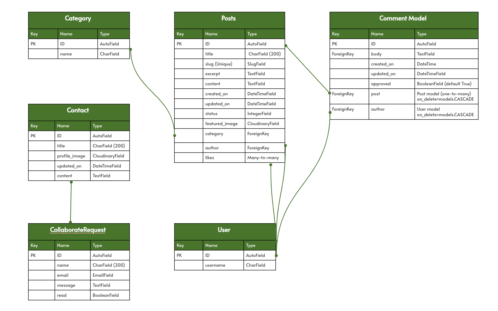

# Cultivating Intelligence


[View Live Website](https://cultivating-intelligence-1ead7384db49.herokuapp.com/) 

Welcome to **Cultivating Intelligence**, a blog dedicated to promoting Diversity, Equity, and Inclusion (DEI) in the workplace, with a particular focus on Attention Deficit Hyperactivity Disorder (ADHD). Our mission is to raise awareness about the unique challenges faced by individuals with ADHD and advocate for equitable practices that empower all employees. Through insightful articles and personal stories, we aim to provide valuable resources for both employers and employees. Join us in fostering a work culture that values every voice and ensures everyone has the opportunity to thrive.


[View Repository](https://github.com/Josseyo/Cultivating_Intelligence)  

---

## Features

- User registration and login
- Comment creation, editing, and deletion
- Like and comment functionality
- Category filtering for posts
- Contact form for collaboration requests
- Links to social media for easy contact
- Admin panel for managing content
- Placeholder default image 
- Custom 404 error page
- Cookie consent management

---

## Wireframes

**Homepage**: Users arrive at the homepage displaying all published posts, with options to filter by category from the navbar.

<details><summary>View Post List</summary>


</details>

---

**Post Detail View**: Users can click on a post to view its full content, along with options to **like** and **comment**.

<details><summary>Post Detailed View</summary>

</details>

---

**Account Registration**: Users must register to like or comment, with a straightforward registration process.

<details><summary>Signup, Login, Logout</summary>

</details>

---

**Contact Us**: Users can reach out for contributions and collaboration ideas through a contact form.

<details><summary>Contact View</summary>

</details>

---

## Agile Methodology

A Kanban board was created using GitHub Projects to manage user stories and the development process.

### MoSCoW Prioritization

- **Must Have**: Core functionalities for MVP.
- **Should Have**: Important features for future development.
- **Could Have**: Enhancements for user experience.
- **Would Be Nice To Have**: Additional features for future consideration.

### User Stories
User stories were categorized using different labels.

[View all user stories in Kanban view here](https://github.com/users/Josseyo/projects/4)

## User Experience

<details><summary>As a Site User, I can view a list of posts to select one to read. The navigation bar with links to different pages and the footer with links to social media is shown on each page for easy access.</summary>

</details>

---

<details><summary>As a Site User, I can click on a post to read its full text and the post's comments without being logged in. To leave a comment, I must log in, with a link provided to the login view.</summary>

</details>

---

<details><summary>As a Site User, I can navigate to different category pages to filter the posts I want to read.</summary>

</details>

---

<details><summary>As a Site User, I can view the number of likes to identify popular posts.</summary>

</details>

---

<details><summary>As a Site User, I can sign up to become a registered user.</summary>

When I sign up, I receive a verification message confirming successful sign-in.

</details>

---

<details><summary>As a Registered Site User, I can log in to engage in discussions.</summary>

If I forget to enter my name or password, I receive an alert message with instructions.

Upon logging in, I receive a confirmation of successful login.

</details>

---

<details><summary>As a logged-in Site User, I can leave comments on posts to share my input.</summary>

After submitting my comment, I receive a confirmation that it was added successfully.

As a logged-in Site User, I can edit and delete my own comments if I change my mind.
</details>

---

<details><summary>As a logged-in Site User, I can like or unlike posts to show my appreciation.</summary>

</details>

---

<details><summary>As a Site User, I can fill in a form to send a contact request.</summary>
If I miss filling a required field, I receive an alert to notify me.

After submitting, I receive a confirmation message indicating that my message has been sent.

</details>

---

<details><summary>As a Site User, I find links in the footer of every page, allowing me to easily contact Cultivating Intelligence on social media.</summary>

</details>

---

<details><summary>As a Site User, I will land on a 404 error page that alerts me that the requested page does not exist and provides a link to return to Home.</summary>

</details>

---

<details><summary>As a logged-in user, I can log out by confirming my intention to sign out.</summary>

After signing out, I receive a verification alert.

</details>

---

<details><summary>As a Site Admin, I can log in to the Django dashboard to manage posts, comments, categories, and users.</summary>

</details>

---

### Colors

Colors were chosen to create a visually appealing and supportive environment for individuals with ADHD, promoting focus and reducing distractions.


<details><summary>About the Colors</summary>

### **White (#ffffff)**
A pure, clean color representing simplicity and clarity.

**Benefits**: White creates a sense of spaciousness and reduces distractions, allowing individuals with ADHD to focus better on the content. It is used as the background for the navbar and for text on dark backgrounds to create good contrast.

### **Light Background (#fffce9)**
A soft, warm off-white with a hint of yellow.

**Benefits**: A gentle background on the eyes promotes warmth and comfort, reducing visual strain and making it easier for individuals with ADHD to engage with the content.

### **Blue (#003f66)**
A deep, calming blue that conveys trust and stability.

**Benefits**: Blue is known for its calming effects and can enhance concentration, helping individuals with ADHD feel more focused and less anxious.

### **Dark Grey (#c05b56)**
A muted, earthy tone that adds depth and sophistication.

**Benefits**: Dark grey provides strong contrast without being too harsh, helping to highlight important information and evoke a sense of seriousness.

### **Gold (#b0702a)**
A rich, warm gold that evokes feelings of positivity and warmth.

**Benefits**: Gold can stimulate feelings of optimism and creativity, drawing attention and encouraging engagement without overwhelming the viewer. It is used for details in the logo/brand name.
</details>

---

### Fonts
Fonts for an ADHD-Friendly Blog

- **Lato**: A sans-serif typeface used for the brand logo. Its clean letterforms enhance readability, reducing visual clutter and helping users focus on the text. 
[Check out Lato on Google Fonts](https://fonts.google.com/specimen/Lato)

- **Roboto**: A modern sans-serif design that enhances readability and establishes clear content hierarchy. Its balanced spacing creates a comfortable reading experience, improving accessibility and engagement for all users.
[Check out Roboto on Google Fonts](https://fonts.google.com/specimen/Roboto)

---

- **Font Awesome** is used for social media brand icons.

[Check out icons on Font Awesome](https://fontawesome.com/)

---

### Imagery
- Post images sourced from: [Stock Cake](https://stockcake.com)
- Default blog post image from [Unsplash](https://unsplash.com)

---

## Entity-Relationship Diagram (ERD)  
The database structure is based on a PostgreSQL model, representing tables, columns, relationships, and constraints.

### Database Models
- **Post Model**: Contains details for each blog post, including title, content, and author. This model includes a method to count the total likes for each post.
- **Comment Model**: Manages comments associated with posts.
- **Category Model**: Organizes posts into categories.
- **Contact Model**: Serves as a reference point for multiple `CollaborateRequest` instances.
- **CollaborateRequest Model**: Ensures that all requests are tracked effectively.

### ERD Relationships

- **User to Post**: One-to-Many (A user can have multiple posts; each post is associated with one user.)
- **User to Comment**: One-to-Many (A user can have multiple comments; each comment is associated with one user.)
- **Post to Comment**: One-to-Many (A post can have multiple comments; each comment is associated with one post.)
- **Category to Post**: One-to-Many (A post belongs to one category; a category can have multiple posts.)
- **Contact to CollaborateRequest**: One-to-Many (A contact can have multiple `CollaborateRequests`; each `CollaborateRequest` is linked to only one contact.)

<details><summary>Click to view ERD</summary>


[View ERD](https://docs.google.com/presentation/d/1CF1Q54uuGRmJGlnQ6oZJiOQuT8qSisuKo4ukPUVWv6w/edit?usp=sharing)
</details>

---

## Database
The project utilizes the [CI Database](https://dbs.ci-dbs.net/).

## Storage
[Cloudinary](https://cloudinary.com/) is used for managing images in the cloud.

## Code Structure
The project code is organized within application folders, constructed using the Django framework.

**<details><summary>Code Structure</summary>**

</details>

**<details><summary>Project Apps</summary>**
- `Blog`
- `Contact`
- `Cultivating Intelligence`
</details>

**<details><summary>Installed Apps</summary>**
   - `django.contrib.admin`
   - `django.contrib.auth`
   - `django.contrib.contenttypes`
   - `django.contrib.sessions`
   - `django.contrib.messages`
   - `django.contrib.staticfiles`
   - `cloudinary_storage`
   - `django.contrib.sites`
   - `allauth`
   - `allauth.account`
   - `allauth.socialaccount`
   - `crispy_forms`
   - `crispy_bootstrap5`
   - `django_summernote`
   - `cloudinary`
   - `blog`
   - `contact`
</details>

**<details><summary>Other Django Files</summary>**
- **settings.py**: Configuration settings for the Django project.
- **Procfile**: Commands for deploying the Django app.
- **static**: Base CSS and JavaScript files.
- **templates**: Base-level and app-specific HTML templates.
- **requirements.txt**: Lists dependencies for the project.
- **env.py**: Stores environment variables securely.
</details>


## Testing & Validation

Features and workflows were manually tested across different screen sizes and browser compatibility. The code was validated with:

- **HTML**: Validated using the [W3C HTML Validator](https://validator.w3.org/)
- **CSS**: Validated using the [Jigsaw W3 Validator](https://jigsaw.w3.org/css-validator/)
- **JavaScript**: Validated using [JS Hint](https://jshint.com)
- **Python**: Validated using the [CI Python Linter](https://pep8ci.herokuapp.com/)
- **Performance**: Validated using [Lighthouse](https://developers.google.com/web/tools/lighthouse/)
- **Accessibility**: Validated using the [Wave Validator](https://wave.webaim.org/) 

**See detailed [Test Report](docs/TESTING.md)**

## Heroku Deployment

Before deploying to Heroku, ensure you have the following variables prepared:

- **Database URL**
- **SECRET_KEY** (You can generate one [here](https://miniwebtool.com/django-secret-key-generator/))
- **CLOUDINARY_URL** (After logging in to the Cloudinary website, copy the 'Cloudinary URL' from your account dashboard)

<details><summary>Deploying to Heroku - Step by Step</summary>

1. **Create `env.py`**: At the root level of your project, create a file named `env.py` and add the following lines, replacing the placeholders with your actual values:

   ```python
   import os

   os.environ['DATABASE_URL'] = 'your_database_url'
   os.environ['SECRET_KEY'] = 'your_secret_key'
   os.environ['CLOUDINARY_URL'] = 'your_cloudinary_url'
   ```

2. **Sign Up or Log In to Heroku**:
   - Go to the [Heroku website](https://www.heroku.com/) and sign up or sign in to your account.

3. **Create a New App**:
   - From the Heroku dashboard, click on "Create New App."
   - Choose a unique name for your app and select the appropriate region, then click on the 'Create App' button.

4. **Set Up Environment Variables**:
   - Navigate to the 'Settings' tab of your newly created app.
   - Click on 'Reveal Config Vars' and add the following environment variables:
     - `DATABASE_URL`: Your Database URL
     - `SECRET_KEY`: Your generated secret key
     - `CLOUDINARY_URL`: Your Cloudinary URL
     - `DISABLE_COLLECTSTATIC`: Set this variable to `1` (this can be removed after the initial deployment)
     - `PORT`: Set this variable to `8000`

5. **Deploy Your App**:
   - Select the 'Deploy' tab from the dashboard.
   - In the Deployment method section, choose "Connect to GitHub."
   - Find your GitHub repository by name and connect it.
   - At the bottom of the page, select either "Automatic Deploys" or "Manual Deploys" based on your preference.

6. **Start the Deployment Process**:
   - Click on the option you chose, and you should see the deployment process begin.

</details>

---

<details><summary>Forking the GitHub Repository</summary>

1. **Log In or Sign Up**:
   - Go to [GitHub](https://github.com/) and log in or create an account.

2. **Access the Repository**:
   - Navigate to the [GitHub repository](https://github.com/Josseyo/Cultivating_Intelligence).

3. **Fork the Repository**:
   - Click the "Fork" button in the top right corner.
   - A copy of the repository will be created in your own GitHub account.

</details>

---

<details><summary>Cloning a GitHub Repository</summary>

1. **Go to the Repository**:
   - Visit the [GitHub repository](https://github.com/Josseyo/Cultivating_Intelligence).

2. **Locate the Code Button**:
   - Click the "Code" button above the list of files (next to 'Add file').

3. **Choose a Cloning Option**:
   - Select either HTTPS or GitHub CLI as your preferred cloning method.

4. **Open Git Bash**:
   - Launch Git Bash on your computer.

5. **Change Directory**:
   - Navigate to the directory where you want to clone the repository.

6. **Clone the Repository**:
   - Type the following command, replacing the URL with the one you copied:

   ```bash
   git clone https://github.com/Josseyo/Cultivating_Intelligence
   ```

7. **Press Enter**:
   - Hit Enter to create your local clone of the repository.

</details>

---

## Future Improvements

- Implement a [caching audit](https://github.com/GoogleChrome/lighthouse/blob/main/core/audits/byte-efficiency/uses-long-cache-ttl.js) to ensure static assets have an effective caching policy.
- Use WebP format for all blog post images to improve page speed.
- Add width and height attributes to blog post images for better layout control.
- Implement local timestamps on comments for better context.
- Add comment counts on the Home page and Category post list page, similar to the post detail view, where both like and comment counts are shown.
- Include back and forward navigation links on post detail pages for easier navigation between posts.
- Implement nested comments for hierarchical discussions.
- Allow users to tag posts for easier searching.
- Complete remaining user stories; see the [project backlog](https://github.com/users/Josseyo/projects/4/views/1).

## Technologies

### Development Tool
- **IDE**: [Gitpod](https://www.gitpod.io/)

**The following technologies were utilized in this project:**

### Backend
- **Python**: The primary language for backend development.
- **Django**: A Python web framework for rapid development and clean design. [Django Documentation](https://docs.djangoproject.com/)
- **Django Allauth**: Manages authentication, registration, and account management. [Django Allauth Documentation](https://django-allauth.readthedocs.io/)

### Frontend
- **HTML**: The standard markup language for creating web pages.
- **CSS**: Styles web page layout and design.
- **JavaScript**: Adds interactivity to web pages.
- **Bootstrap**: A front-end framework for responsive, mobile-first web development, using [Bootstrap 5.3](https://getbootstrap.com/docs/5.3/getting-started/introduction/).
- **Font Awesome**: A toolkit for icons and fonts. [Font Awesome](https://fontawesome.com/)
- **Google Fonts**: A library of web fonts. [Google Fonts](https://fonts.google.com/)

### Database
- **PostgreSQL**: An open-source relational database system. [PostgreSQL](https://www.postgresql.org/)

### Storage
- **Cloudinary**: Manages images and videos in the cloud. [Cloudinary](https://cloudinary.com/)

### Other Tools and Libraries
- **Git**: Version control system to track changes in source code. [Git Documentation](https://git-scm.com/doc)
- **GitHub**: Platform for version control and collaborative development. [GitHub](https://github.com/)
- **Whitenoise**: Serves static files for Python web apps. [Whitenoise Documentation](http://whitenoise.evans.io/en/stable/)

## Packages
The packages installed for this project can be found in `requirements.txt` and include:

- [asgiref==3.8.1](https://pypi.org/project/asgiref/)
- [cloudinary==1.40.0](https://pypi.org/project/cloudinary/)
- [crispy-bootstrap5==2024.2](https://pypi.org/project/crispy-bootstrap5/)
- [dj-database-url==0.5.0](https://pypi.org/project/dj-database-url/)
- [dj3-cloudinary-storage==0.0.6](https://pypi.org/project/dj3-cloudinary-storage/)
- [Django==5.0.7](https://pypi.org/project/Django/)
- [django-allauth==0.57.2](https://pypi.org/project/django-allauth/)
- [django-crispy-forms==2.3](https://pypi.org/project/django-crispy-forms/)
- [django-summernote==0.8.20.0](https://pypi.org/project/django-summernote/)
- [gunicorn==22.0.0](https://pypi.org/project/gunicorn/)
- [oauthlib==3.2.2](https://pypi.org/project/oauthlib/)
- [psycopg2==2.9.9](https://pypi.org/project/psycopg2/)
- [PyJWT==2.8.0](https://pypi.org/project/PyJWT/)
- [python3-openid==3.2.0](https://pypi.org/project/python3-openid/3.2.0/)
- [pytz==2024.1](https://pypi.org/project/pytz/2024.1/)
- [requests-oauthlib==2.0.0](https://pypi.org/project/requests-oauthlib/)
- [sqlparse==0.5.0](https://pypi.org/project/sqlparse/)
- [urllib3==1.26.15](https://pypi.org/project/urllib3/)
- [whitenoise==6.7.0](https://pypi.org/project/whitenoise/)

## Dependencies

For full details on project dependencies, please refer to the `requirements.txt` file in the project repository.

## Credits

- CI LMS 
- CI Django Blog Tutorial: [YouTube Video](https://www.youtube.com/watch?v=YH--VobIA8c&t=1453s)
- How to create a custom 404 error page: [MakeUseOf](https://www.makeuseof.com/create-custom-404-error-page-django/)
- User Stories Reference: [CI Blog User Stories](https://github.com/Code-Institute-Solutions/BlogUserStories/blob/main/userstories.md)
- User Stories Reference: [GitHub Repository Rockroman](https://github.com/rockroman/CI_PP4-Knowledge-Flow/blob/main/README.md?plain=1)
- User Stories Reference: [GitHub Repository ShizukaDonague](https://github.com/ShizukaDonaghue/happy-beans?tab=readme-ov-file)
- Troubleshooting support: [Linus Johansson](https://github.com/j0hanz)


