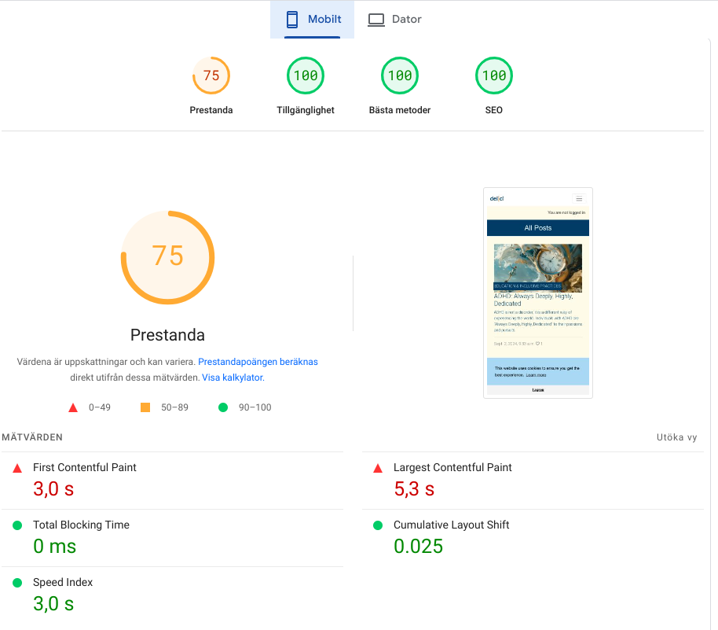
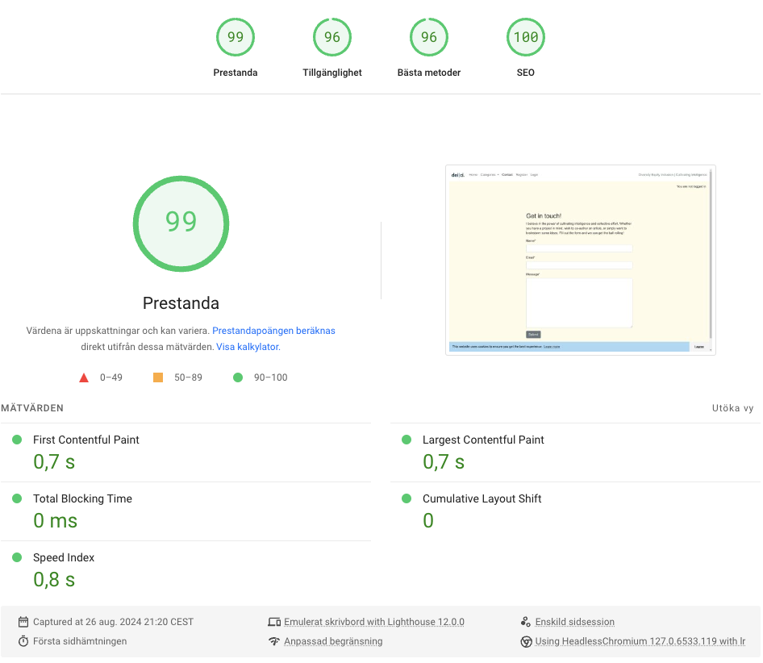
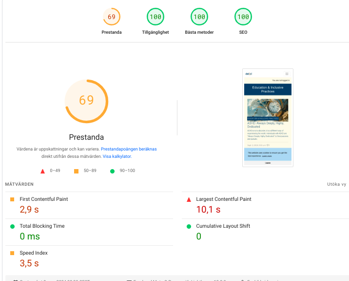

# Manual Testing

### Registration
- [X] **Navigate to Sign-Up page**: `/account/signup/`
- [X] **Fill registration form with valid details**: 
  - Username, email, password
- [X] **Submit registration form**
- [X] **Verify registration success**:
  - User is redirected to Home page (index page)

### Logout
- [X] **Navigate to Sign-Out page**: `/account/logout/`
- [X] **Sign-Out**
- [X] **Verify Sign-Out success**:
  - User is redirected to the Home page (index page)

### Login
- [X] **Navigate to Sign-In page**: `/account/login/`
- [X] **Enter valid credentials and log in**
- [X] **Verify login success**:
  - User is redirected to the Home page (index page)

### Add a Comment
- [X] **Navigate to a specific post's detail page**: `/posts/<slug>/`
- [X] **Add a comment to the post**
- [X] **Submit comment form**
- [X] **Verify comment creation success**:
  - Comment is displayed under the post

### Delete a Comment
- [X] **Delete a comment**
- [X] **Verify comment deletion success**:
- User is redirected to the post detail page where the comment is deleted.

### Edit a Comment
- [X] **Edit a comment**
 - takes you to the edit comment page:`/posts/<slug>/edit_comment/`
- [X] **The comment form is prefilled with the comment to edit**
- [X] **Verify comment update success**:
 -User is redirected to the post detail page

### Like a Post
- [X] **Like a post**
- [X] **Unlike a post**

### 404 page
-[X] **Redirected to 404 page**
-[X] **Go back to Home**

### General Functionality
- [X] **Verify home page displays latest posts**:
  - Ensure pagination is working (6 posts per page)

### Responsiveness
- [X] **Check responsiveness**:
  - Ensure the website looks good and works well on phones, tablets, and computers

### Contact Page
- [X] **Navigate to Contact page**: `/contact/`
- [X] **Enter valid contact information and submit request**
- Ensure a valid email address is entered
- [X] **Verify contact request submit**:

### Error Handling
- [X] **Test invalid login attempt**:
  - Enter incorrect credentials and submit
  - Verify appropriate error message is displayed

- [X] **Test invalid form submissions**:
  - Leave required fields empty and submit forms
  - Verify appropriate error messages are displayed

### Security
- [X] **Ensure password is not visible when typing**

### Deployment
- [X] **Check deployment settings**:
  - Ensure `DEBUG` is set to `False` in production
- [X] **Verify static file serving**:
  - Ensure static files (CSS, JS, images) are loading correctly in production

### Miscellaneous
- [X] **Verify all links and buttons work as expected**
- [X] **Ensure no broken images on the site**

### Responsiveness
- [X] **The website is fully responsive across all screen sizes**
- [X] **Images maintain their quality without any pixelation or distortion**
- [X] **Page elements are arranged to prevent overlapping**
- [X] **Horizontal scrolling is completely avoided**

### Code Validation

- **HTML** Validated using [W3C HTML Validator](https://validator.w3.org/)
- **CSS** Validated using [Jigsaw W3 Validator](https://jigsaw.w3.org/css-validator/)
- **Javascript** validated using [JS hint](https://jshint.com)
- **Python** validated using [CI Python Linter](https://pep8ci.herokuapp.com/)
- **Performance** validated using [Lighthouse](https://developers.google.com/web/tools/lighthouse/)
- **Accessibility** validated using [Wave Validator](https://wave.webaim.org/) 

### Html
[W3C HTML Validator](https://validator.w3.org/) was used to validate html templates

#### HTML validated without errors

Home

Register (errors)

Unsolved errors in Django signup template:

Login

Logout

Blog detail (error)

Unsolved error in Django admin add post: 

Category

Comment edit

***

Some Html errors and fixes

### CSS validated without errors
[Jigsaw W3 Validator](https://jigsaw.w3.org/css-validator/) was used to validate the css styling

Home

Blog post

   
### Javascript
[JShint](https://jshint.com/) was used to validate the custom Javscript files

Comments.js

Cookies.js

### Python
[CI Python Linter](https://pep8ci.herokuapp.com/) was used to validate the Python code.

   **

Blog app - Python files 
**
   
   

   **

Contact app - Python files 
**
   
   

   **

Cultivating Intelligence - Python files 
**
   
   

---

### Lighthouse

[Lighthouse](https://developers.google.com/web/tools/lighthouse/) used for analyzing performance, accessibility and SEO for the project. Below are the results of the analysis:
 

Home Desktop-screen

Home Mobile-screen

Contact page Desktop-screen

Contact page Mobile-screen

Blog detail Desktop-screen

 

To improve Accessibility I added alt text to the icons:
 

Blog detail Mobile-screen

Category Desktop-screen

Category Mobile-screen

[Category Mobile-screen](https://pagespeed.web.dev/analysis/https-cultivating-intelligence-1ead7384db49-herokuapp-com-category-Workplace%20Strategies/ehokhlzwbe?form_factor=mobile&category=performance&category=accessibility&category=best-practices&category=seo&hl=sv&utm_source=lh-chrome-ext)

Comment edit Desktop-screen

[Comment edit Desktop-screen](https://pagespeed.web.dev/analysis/https-cultivating-intelligence-1ead7384db49-herokuapp-com-adhd-always-deeply-highly-dedicated-edit_comment-127/o50n6hpg0o?use_original_url=true&hl=sv&form_factor=desktophttps://pagespeed.web.dev/analysis/https-cultivating-intelligence-1ead7384db49-herokuapp-com-adhd-always-deeply-highly-dedicated-edit_comment-127/o50n6hpg0o?use_original_url=true&hl=sv&form_factor=desktop)

Comment edit Mobile-screen

[Comment edit Mobile-screen](https://pagespeed.web.dev/analysis/https-cultivating-intelligence-1ead7384db49-herokuapp-com-adhd-always-deeply-highly-dedicated-edit_comment-127/o50n6hpg0o?use_original_url=true&hl=sv&form_factor=mobile)

Register page Desktop-screen

[Register page Desktop-screen](https://pagespeed.web.dev/analysis/https-cultivating-intelligence-1ead7384db49-herokuapp-com-accounts-signup/p39w03m9g3?form_factor=desktop&category=performance&category=accessibility&category=best-practices&category=seo&hl=sv&utm_source=lh-chrome-ext)

Register page Mobile-screen

[Register page Mobile-screen](https://pagespeed.web.dev/analysis/https-cultivating-intelligence-1ead7384db49-herokuapp-com-accounts-signup/p39w03m9g3?form_factor=mobile&category=performance&category=accessibility&category=best-practices&category=seo&hl=sv&utm_source=lh-chrome-ext)

---

### Wave
[Wave Validator](https://wave.webaim.org/) to evaluate accessibility

Home

Register

Login

Logout

Confirm logout

Blog detail

Category

---

### Errors and fixes

Some errors and fixes along the way

